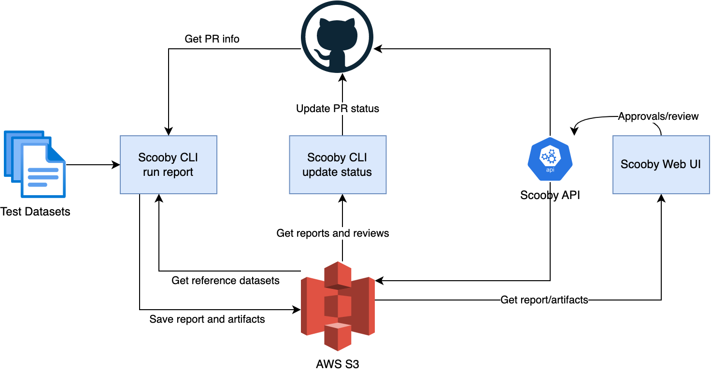
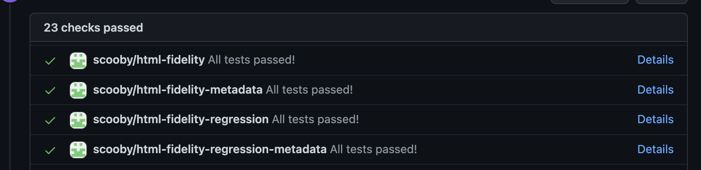
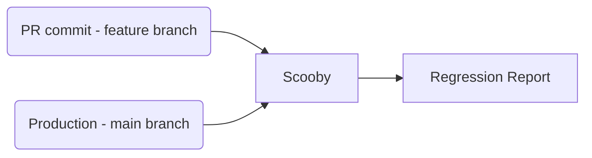

_Scooby_ is an optimized regression and fidelity testing framework.
It can be used to test for regressions (both visual and textual), and provides all
tools and integrations necessary to streamline the experience (a CLI, a review UI, web service, and more).

For a quick introduction and demo, see this video:

TODO

Example use-cases:

- **Prevent visual regressions in your website UI**
  - After a PR is opened, you can use Scooby to verify that the changes didn't
    cause any unwanted regression in your website UI, flagging them for review and approval if necessary.
- **Test for regressions in generated configuration files**
  - You might use Scooby to do Snapshot testing of your UI structure (JSON) or other configuration files. With Scooby, you can avoid committing the snapshots into your repository, and instead generate and compare them on the fly inside a CI pipeline.
- **Support migrations by comparing the output of two systems**
  - If you are migrating a system, you might want to verify that the output of the new system is equal to the legacy one. Scooby can be used to compare and visualize the differences between the outputs, flagging them up for review and approval if necessary
- **Test for Storybook components regressions (soon)**
  - Verify that a code change doesn't cause any visual regression in your Storybook components

Scooby was built with these goals in mind:

- Make it easy to add new regression and fidelity tests, both visual and textual
- Support multiple test formats out of the box (such as HTML, PNG, code, etc) to minimize the amount of boilerplate glue code.
- Being cost-efficient
- Be highly extensible to support new kinds of tests and reports
- Integrate well with our GitHub-based workflows

Scooby has been extensively battle-tested at [Anima](https://www.animaapp.com/), where is powering most of our production pipelines.

# Overview

Scooby is composed of three main components:

- A **CLI** used to run reports, either locally or inside a CI pipeline
- A **Web UI** used to view reports, and leave reviews (approvals, rejections, etc)
- (Optional) An **API** service to send reviews, and other actions. Scooby can also work without this component, but approvals won't work in the Web UI without it.

While Scooby has been built to be storage-agnostic, as of now, only **AWS S3 buckets** are supported as destination for reports and artifacts. If you are interested in other storage options, please open an issue!

The typical flow of a Scooby-powered report looks as follows:

1. The Scooby CLI is invoked to run a given report, pointing it to the relevant test dataset
2. After all report tasks have been run, the Scooby CLI is called to update the GitHub Status
3. Reports can be then viewed on the Scooby Web UI, and reviewers can approve/reject them

The following diagram illustrates an high-level overview of the system:



# Getting started

This section covers the basics to use Scooby in your projects.
We'll start from the initial repository setup, gradually
covering all the steps to get a simple working setup.

> **Note for Scooby developers**: this section does not cover how to contribute to the Scooby project.
> If your goal is to extend or modify Scooby itself, please
> head to the [Developer guide](#developer-guide) section below.

## First-time repository setup

If this is the first time Scooby is used inside your project,
you'll need to set up a couple of things beforehand.

### Environment variables

Scooby requires several environment variables to work.
These variables provide the information and access tokens necessary
to generate reports, upload artifacts, update GitHub statuses and more.

These are the environment variables you need to specify in the project CI:

> If you are using CircleCI in your project, you'll need to specify them
> inside the Project Settings > Environment Variables section.

| Name                           | Description                                                                                                                                                       |
| ------------------------------ | ----------------------------------------------------------------------------------------------------------------------------------------------------------------- |
| `SCOOBY_AWS_S3_BUCKET`         | The name of the AWS S3 bucket that will host the reports and artifacts.                                                                                           |
| `SCOOBY_AWS_S3_REGION`         | The AWS region for the S3 bucket, such as `us-west-2`                                                                                                             |
| `SCOOBY_AWS_ACCESS_KEY_ID`     | An AWS Access Key ID with write access to the S3 bucket. There are important security considerations you should keep in mind, please read the TODO section below. |
| `SCOOBY_AWS_SECRET_ACCESS_KEY` | The AWS secret access key associated with the above account.                                                                                                      |
| `SCOOBY_GITHUB_ACCESS_TOKEN`   | A Github Access Token with write access to the repository you are planning to use.                                                                                |
| `SCOOBY_WEB_BASE_URL`          | Set this to `https://animaapp.github.io/scooby` unless you're planning to host the frontend somewhere else.                                                       |

After the necessary environment variables have been set, you are ready to generate a Scooby report.

## Generating your first Scooby report on CircleCI

In this section, we'll discuss the process to generate a visual regression report.
In particular, the goal is to have an automated check that fails whenever some HTML pages change visually.

> While this example focuses on visual regression reports, other report types can be generated
> following a similar process. Please refer to the Reference section below for more information.

Assuming that the test HTML files are located in the `path/to/tests` folder,
you can generate a Scooby regression report by running this command:

```
npx @animaapp/scooby-cli regression --name "my-html-regression" --tests path/to/tests --file-type=html
```

This command tells Scooby to generate a regression report named `my-html-regression` based
on all HTML files located in the `path/to/tests` folder.
Scooby will automatically take care of comparing these HTML files with the known reference
(usually the one on `main` branch).

Now that we generated the report, we are ready to trigger the GitHub status update, which will show
the status for each report in our PRs and commits:



To update the GitHub status, you'll need to run:

```
npx @animaapp/scooby-cli update-status
```

For efficiency reasons, it's better to run the `update-status` step only after all Scooby
report tasks have been completed.
If you are running multiple reports in parallel on CircleCI, a common pattern
is to use job dependencies:

```yaml
- run-scooby-fidelity-tests:
    context: anima-prod
- run-scooby-regression-tests:
    context: anima-prod
- scooby-update-status:
    context: anima-prod
    requires:
      - run-scooby-regression-tests
      - run-scooby-fidelity-tests
```

In this example, the `scooby-update-status` job is only run after the two other report tasks
have been completed, thus invoking `update-status` only once.

# FAQ

This section discusses some of the commonly asked questions related
to Scooby or testing in general.

## What's the difference between Fidelity and Regression tests?

While Fidelity and Regression tests share some common aspects,
they are designed to answer two very different questions:

- **Regression tests compare _two different versions of the same dataset_**.
  For example, a regression test might verify that the output of a
  code generator inside a feature branch is not different from a
  known-good state on the `main` branch.
- **Fidelity tests compare _the same version of two different datasets_**.
  For example, a fidelity test might compare how visually similar a given web page is to its Figma design.

From these definitions, we can draw several conclusions:

- Regression tests usually produce a binary good/bad result for each
  test entry, while fidelity tests produce a continuous similarity ratio.
- Regression tests aim at having zero differences between the two
  datasets, as we are testing the same system at two different points in time.
- Fidelity tests _could_ have differences and still be successful, as
  having a perfect match between datasets produced by two different systems might not be achieavable.

## Why the name _Scooby_?

There are two possible explanations, depending who's asking :D

- Scooby Doo is a famous detective dog, and as a tool, Scooby
  help us _detect_ regressions and problems.
- During our on-site at Anima, one of the conversation topics was
  [Cockney Rhyming slangs](https://en.wikipedia.org/wiki/Rhyming_slang).
  Among the others, turns out _scooby_ is a slang term for _clue_.
  For example, you could say: _I don't have a scooby about it_, which means _I don't have a clue about it_.
  I fell in love with the term, and when it came time to choose a name
  for the project, it was an easy choice.

# Reference

This section acts as a reference for the different tests that can be performed with Scooby, along with other useful commands.

## Visual Regression tests

Visual regression tests can be used to verify if changes introduced
in a commit (PR) are causing visual regressions.

In a nutshell, Scooby compares the dataset generated in a given commit (or PR) with the dataset of the _base commit_ (main branch).
This allow us to determine whether the changes in a given PR are
changing the behavior of our production systems (the ones on main) in a visual way.



### Basic usage

```
npx @animaapp/scooby-cli regression --name "regression-name" --tests /path/to/tests --file-type=html
```

## Visual Fidelity tests

```
npx @animaapp/scooby-cli fidelity --name "fidelity-name" --expected /path/to/expected/tests --actual /path/to/actual/tests --file-type=png
```

# Developer guide

## Running the CLI in Dev Mode

When working on Scooby, you might need to invoke the development version of the CLI with your changes.
From the repository root, you can run the following command:

```
yarn cli:run:dev --help
```

This command will build the CLI from source and invoke it with the `--help` flag. It is equivalent to running `npx @animaapp/scooby-cli --help`.

By changing the argument, you can then test the various CLI commands, for example:

```
yarn cli:run:dev fidelity --name "fidelity-name" --expected /path/to/expected/tests --actual /path/to/actual/tests --file-type=png
```

# Troubleshooting

## Error: Could not find expected browser (chrome) locally. Run `npm install` to download the correct Chromium revision (1045629).

If you are on macOS you might experience the following error when running Scooby:

```
Error: Could not find expected browser (chrome) locally. Run `npm install` to download the correct Chromium revision (1045629).
```

To solve it, you can force a chromium installation with:

```
node node_modules/puppeteer/install.js
```
