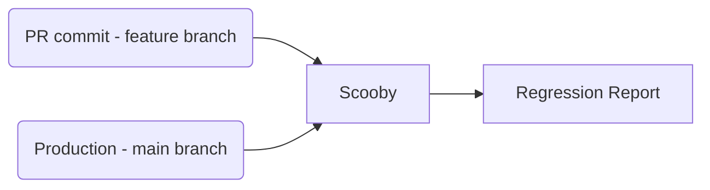

_Scooby_ is an optimized visual, regression and E2E testing framework.
It can be used to generate many different kinds of reports, and integrates
seemlessly with our GitHub-based workflows.

Scooby was built with these goals in mind:

- Make it easy to add new regression, visual, and E2E tests
- Support multiple test formats out of the box (such as HTML, PNG, code, etc) to minimize the amount of boilerplate glue code.
- Being cost-efficient
- Be highly extensible to support new kinds of tests and reports
- Integrate well with our GitHub-based workflows

# Overview

TODO

# Getting started

## First-time repository setup

### Environment variables

## Adding your first Scooby test on CircleCI

## Adding the GitHub status update step

# Reference

This section acts as a reference for the different tests that can be performed with Scooby, along with other useful commands.

## Visual Regression tests

Visual regression tests can be used to verify if changes introduced
in a commit (PR) are causing visual regressions.

In a nutshell, Scooby compares the dataset generated in a given commit (or PR) with the dataset of the _base commit_ (main branch).
This allow us to determine whether the changes in a given PR are
changing the behavior of our production systems (the ones on main) in a visual way.



### Basic usage

```
npx @animaapp/scooby-cli regression --name "regression-name" --tests /path/to/tests
```

## Visual Fidelity tests

```
npx @animaapp/scooby-cli fidelity --name "fidelity-name" --expected /path/to/expected/tests --actual /path/to/actual/tests
```

# Developer guide

# Troubleshooting

## Error: Could not find expected browser (chrome) locally. Run `npm install` to download the correct Chromium revision (1045629).

If you are on macOS you might experience the following error when running Scooby:

```
Error: Could not find expected browser (chrome) locally. Run `npm install` to download the correct Chromium revision (1045629).
```

To solve it, you can force a chromium installation with:

```
node node_modules/puppeteer/install.js
```
